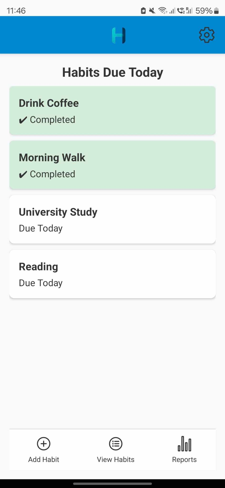
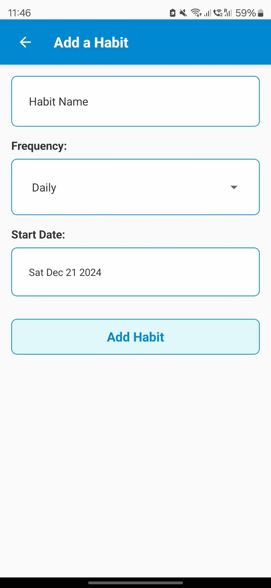

# Habit Tracker Mobile

This is the mobile version of the Habit Tracker application, built using React Native with Expo, designed to help you build, track, and maintain habits effortlessly. Whether you're forming new routines or improving existing ones, Habit Tracker helps you stay consistent while visualizing your progress with detailed statistics and reports.

## Features

**Flexible Habit Management**
- Add, edit, and delete habits tailored to your lifestyle.
- Customizable frequencies: **Daily, Weekly, Monthly,** or **Custom** (e.g., Mon-Wed-Fri or Sat-Sun).
- Forgot to mark a habit yesterday? No problem! Mark previous days as complete via the Progress Screen by pressing the desired day on the calendar.

**Progress Tracking**
Gain insights into your habits with:

- **Current Streaks** and B**est Streaks**.
- Detailed **Weekly** and **Monthly** Completion Rates.
- **Weekly** and **Monthly** Consistency Metrics.
- Completion Calendar highlighting completed dates in light green.

**Reminders**
Stay consistent with habit reminders:

- Local notifications for habits due on their due dates.
- Flexible management of reminders per habit in the Settings Page.

**Light and Dark Mode**
- Seamlessly switch between light and dark themes for a comfortable user experience.

**Reports and Insights**
Comprehensive **Monthly Reports** which include:

- Color-coded completion rates: Green (80%+), Yellow (40%-79%), and Red (<40%).
- A summary section featuring: Best-performing habit, Total habits tracked, Average completion rate, and Frequently missed habits.

**Your Data is Yours**
Export habit progress and data to CSV files for backup or further analysis.

## Gallery

Below are screenshots showcasing the current status of the Habit Tracker Mobile app:

| **Home Screen** | **Habit List Screen** | **Add Habit Screen** |
|------------------|-----------------------|-----------------------|
|  |  |  |

| **Habit List (Menu)**                                  | **Progress Screen**                                    | **Reports Screen**                                  |
|--------------------------------------------------------|-------------------------------------------------------|----------------------------------------------------|
|  |   |  |

## How to Run

1. Clone the repository:
   ```bash
   git clone https://github.com/johnnycwatt/Habit-Tracker-Mobile.git
   ```
2. Navigate into the project directory:
   ```bash
   cd Habit-Tracker-Mobile
   ```
3. Install dependencies:
   ```bash
   npm install
   ```
   Ensure the following dependencies are installed to run with **Expo**:
  - `expo`
  - `@react-native-async-storage/async-storage`
  - `@react-native-community/datetimepicker`

   If any dependencies are missing, install them using `npm install <dependency-name>`.

4. Start the app with Expo:
   ```bash
   npx expo start
   ```
5. Scan the QR code with Expo Go on your mobile device to run the app.

## License

This project is licensed under the MIT License - see the [LICENSE](LICENSE) file for details.

## Contact

For questions, feedback, or issues, please reach out:

- **Email**: [johnnycwatt@gmail.com](mailto:johnnycwatt@gmail.com)
- **GitHub**: [Johnny's GitHub](https://github.com/johnnycwatt)

