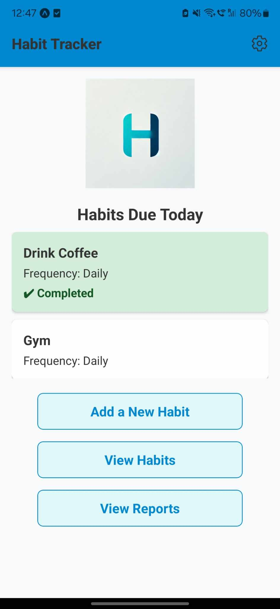
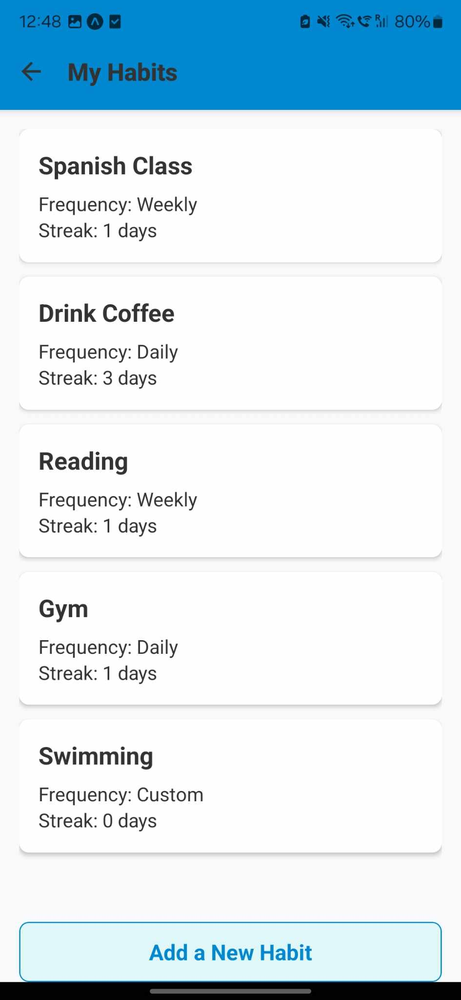
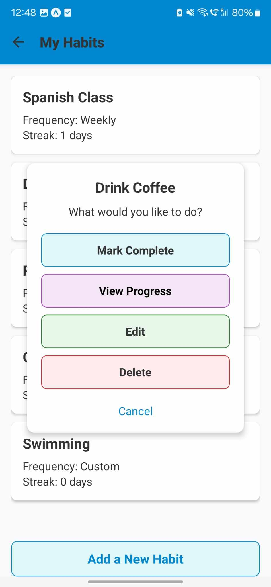
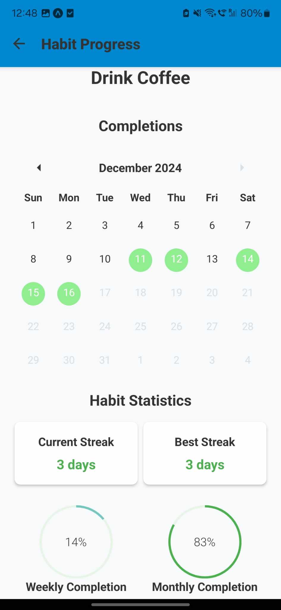

# Habit Tracker Mobile

This is the mobile version of the Habit Tracker application, built using React Native with Expo.

## Features

### Implemented
- Add, edit, and delete habits.
- Support for multiple frequencies: **Daily**, **Weekly**, **Monthly**, and **Custom** (e.g., Mon-Wed-Fri or Sat-Sun).
- Progress tracking with:
    - **Current Streaks** and **Best Streaks**.
    - **Weekly** and **Monthly Completion Rates**.
    - **Weekly** and **Monthly Consistency Metrics**.
- Calendar view highlighting:
    - Completed habit dates for the current and previous months (light green).
    - Current Date (light blue) 
- Navigation between `HomeScreen`, `AddHabitScreen`, `EditHabitScreen`, `HabitListScreen`, and `ProgressScreen`.
- CRUD operations using AsyncStorage for habit storage.
- Monthly Reports which offer the following:
  - Color coded reporting with habits displayed either Light Green, Light Yellow, or Light Red depending on their completion rates.
  - Summary section showing best habit, total habits, average completion, and frequently missed habits.
  - Filter options to view habits by frequency (Daily, Weekly, Monthly, Custom).

### Planned
- Monthly Reporting.
- Notifications for habit reminders and milestones.
- Export data for sharing and backups.

## Gallery

Below are screenshots which show the current status of the Habit Tracker Mobile app:

| **Home Screen** | **Habit List Screen** | **Add Habit Screen** |
|------------------|-----------------------|-----------------------|
|  |  |  |

| **Habit List (Menu)**                                  | **Progress Screen** |
|--------------------------------------------------------|---------------------|
|  |  |

## How to Run
1. Clone the repository: `git clone https://github.com/johnnycwatt/Habit-Tracker-Mobile.git`
2. Install dependencies: `npm install`
3. Start the app: `npm start`

## License

This project is licensed under the MIT License - see the [LICENSE](LICENSE) file for details.

## Contact

For questions, feedback, or issues, please reach out:

- **Email**: [johnnycwatt@gmail.com](mailto:johnnycwatt@gmail.com)
- **GitHub**: [Johnny's GitHub](https://github.com/johnnycwatt)
