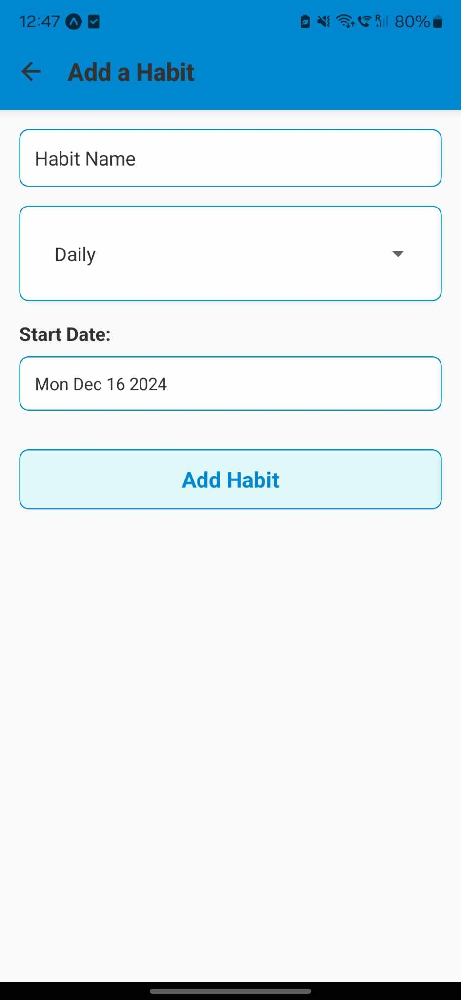

# Habit Tracker Mobile

This is the mobile version of the Habit Tracker application, built using React Native with Expo.

## Features

- Add, edit, and delete habits.
- Support for multiple frequencies: **Daily**, **Weekly**, **Monthly**, and **Custom** (e.g., Mon-Wed-Fri or Sat-Sun).
- Dark Mode support for improved user experience.
- Progress tracking with:
  - **Current Streaks** and **Best Streaks**.
  - **Weekly** and **Monthly Completion Rates**.
  - **Weekly** and **Monthly Consistency Metrics**.
- Calendar view highlighting:
  - Completed habit dates for the current and previous months (light green).
  - Current Date (light blue).
- Monthly Reports featuring:
  - Color-coded reporting, with habits displayed as Light Green, Light Yellow, or Light Red depending on their completion rates.
  - A summary section showing:
    - Best habit.
    - Total habits.
    - Average completion rate.
    - Frequently missed habits.
  - Filter options to view habits by frequency (Daily, Weekly, Monthly, Custom).
- Navigation between `HomeScreen`, `AddHabitScreen`, `EditHabitScreen`, `HabitListScreen`, `ProgressScreen`, and `ReportScreen`.
- CRUD operations using AsyncStorage for habit storage.

## Gallery

Below are screenshots showcasing the current status of the Habit Tracker Mobile app:

| **Home Screen** | **Habit List Screen** | **Add Habit Screen** |
|------------------|-----------------------|-----------------------|
|  |  |  |

| **Habit List (Menu)**                                  | **Progress Screen**                                    | **Reports Screen**                                  |
|--------------------------------------------------------|-------------------------------------------------------|----------------------------------------------------|
|  |   |  |

## How to Run

1. Clone the repository:
   ```bash
   git clone https://github.com/johnnycwatt/Habit-Tracker-Mobile.git
   ```
2. Navigate into the project directory:
   ```bash
   cd Habit-Tracker-Mobile
   ```
3. Install dependencies:
   ```bash
   npm install
   ```
   Ensure the following dependencies are installed to run with **Expo**:
  - `expo`
  - `@react-native-async-storage/async-storage`
  - `react-native-picker-select`
  - `@react-native-community/datetimepicker`

   If any dependencies are missing, install them using `npm install <dependency-name>`.

4. Start the app with Expo:
   ```bash
   npx expo start
   ```
5. Scan the QR code with Expo Go on your mobile device to run the app.

## License

This project is licensed under the MIT License - see the [LICENSE](LICENSE) file for details.

## Contact

For questions, feedback, or issues, please reach out:

- **Email**: [johnnycwatt@gmail.com](mailto:johnnycwatt@gmail.com)
- **GitHub**: [Johnny's GitHub](https://github.com/johnnycwatt)

