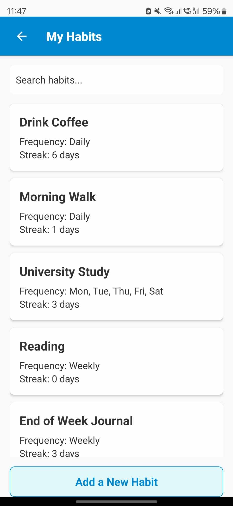
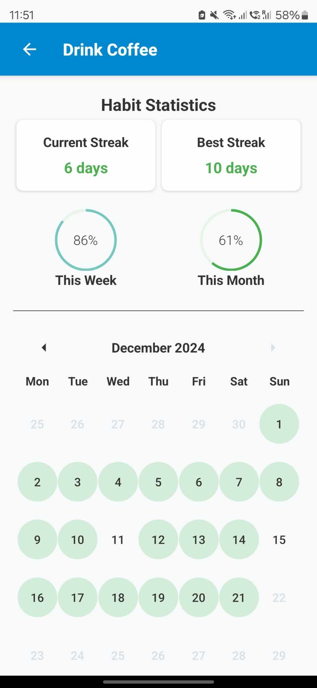

# Habit Tracker Mobile Documentation

This app is designed to help you build and maintain habits effectively while tracking your progress with detailed statistics and visualizations.

---

## Features

- **Add, Edit, and Delete Habits**: Manage your habits seamlessly.
- **Customizable Frequencies**: Daily, Weekly, Monthly, or Custom scheduling of habits.
- **Progress Tracking**: View streaks, completion rates, and consistency metrics.
- **Visual Reports**: Comprehensive monthly reports with color-coded performance metrics.
- **Dark Mode**: Switch between Light and Dark themes
- **Your Data is yours** Export your habit data to CSV

---

## Screenshots

| **Home Screen** | **Add Habit Screen** | **Habit List Screen** |
|------------------|-----------------------|-----------------------|
|  |  |  |

| **Habit List Menu** | **Progress Screen** | **Reports Screen** |
|----------------------|---------------------|---------------------|
|  |  |  |

---

## Documentation

- [Privacy Policy](privacy-policy.md)
- [Help Guide](help-guide.md)

---

## Get Started with Habit Tracker Mobile

Start building great habits today! Access the app's features directly, and explore the above links for detailed guidance and support.

